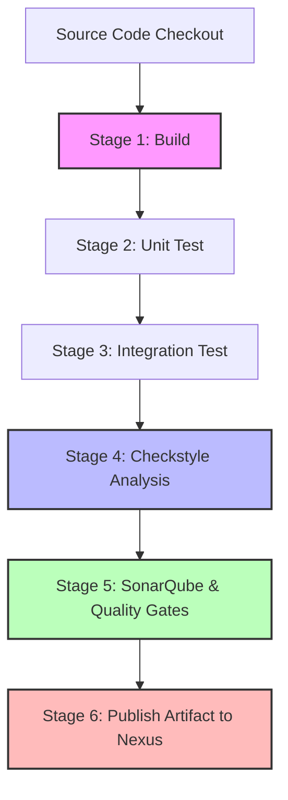

# VProfile DevOps Project: Jenkins CI/CD Pipeline

A comprehensive CI/CD pipeline automation project for **vprofile**, a multi-tier Java Web Application. This repository contains the complete application source code, infrastructure automation scripts (Vagrant & Ansible), and a declarative **Jenkins Pipeline** to automate the build, test, analysis, and artifact publishing workflow.

---

## 🏗️ System Architecture & Technology Stack

The application (`vprofile`) is a robust multi-tier web application that relies on several services to run:

*   **Application Backend:** Java, Spring MVC, Spring Security, Hibernate
*   **Database:** MySQL (relational database storage)
*   **Caching:** Memcached (session caching)
*   **Message Broker:** RabbitMQ (asynchronous messaging)
*   **Search Engine:** Elasticsearch (indexing and search querying)
*   **Web Server:** Tomcat / Jetty
*   **Provisioning & Config Management:** Vagrant, Ansible
*   **CI/CD Pipeline:** Jenkins, Maven, SonarQube, Nexus

---

## 🚀 CI Pipeline Workflow

The declarative [Jenkinsfile](file:///d:/Coding/gitrepos/vprofile-project-ci-jenkins/Jenkinsfile) defines a structured 6-stage continuous integration workflow:



### 📋 Stage Breakdown

#### 1. **BUILD**
*   **Action:** Compiles code and generates the application package.
*   **Command:** `mvn clean install -DskipTests`
*   **Post-Action:** If successful, archives the resulting war artifact (`**/target/*.war`).

#### 2. **UNIT TEST**
*   **Action:** Runs the unit tests to ensure logical correctness.
*   **Command:** `mvn test`

#### 3. **INTEGRATION TEST**
*   **Action:** Verifies integrations between components.
*   **Command:** `mvn verify -DskipUnitTests`

#### 4. **CODE ANALYSIS WITH CHECKSTYLE**
*   **Action:** Performs static analysis on coding standards and styles.
*   **Command:** `mvn checkstyle:checkstyle`

#### 5. **CODE ANALYSIS WITH SONARQUBE**
*   **Action:** Conducts detailed static code analysis, quality profiling, and vulnerability scanning using SonarQube Scanner.
*   **Parameters Passed:**
    *   JUnit test results
    *   JaCoCo code coverage report
    *   Checkstyle results
*   **Quality Gate:** Uses `waitForQualityGate` to abort the pipeline automatically if the quality standards are not met.

#### 6. **PUBLISH TO NEXUS**
*   **Action:** Reads project details from `pom.xml` and uploads the packaged `.war` and `pom.xml` to Sonatype Nexus Repository Manager.
*   **Plugin:** `nexusArtifactUploader`

---

## 📁 Repository Structure

*   [src/](file:///d:/Coding/gitrepos/vprofile-project-ci-jenkins/src) — Contains Java Spring application source code.
*   [vagrant/](file:///d:/Coding/gitrepos/vprofile-project-ci-jenkins/vagrant) — Local VM configurations (Vagrantfiles and shell scripts) for windows, mac, and M1 chips to set up the multi-tier local environment.
*   [ansible/](file:///d:/Coding/gitrepos/vprofile-project-ci-jenkins/ansible) — Playbooks and templates for setting up Tomcat and configuring application properties.
*   [userdata/](file:///d:/Coding/gitrepos/vprofile-project-ci-jenkins/userdata) — Automated shell scripts to bootstrap infrastructure on AWS/servers:
    *   `jenkins-setup.sh`: Installs Java 17 and Jenkins.
    *   `nexus-setup.sh`: Installs Java 17 and configures Nexus OSS.
    *   `sonar-setup.sh`: Provisions SonarQube server.
*   [Jenkinsfile](file:///d:/Coding/gitrepos/vprofile-project-ci-jenkins/Jenkinsfile) — The main CI pipeline definition.
*   [pom.xml](file:///d:/Coding/gitrepos/vprofile-project-ci-jenkins/pom.xml) — Maven configuration with project dependencies, repositories, and coverage plugins (JaCoCo).

---

## 🛠️ Infrastructure Setup

### Local Setup (Vagrant)
To boot up the complete environment locally (including MySQL, Memcached, RabbitMQ, Tomcat, and Nginx):
1. Navigate to `vagrant/Automated_provisioning_WinMacIntel/` (or matching OS folder).
2. Run `vagrant up` to provision all virtual machines.

### Cloud Server Setup (AWS UserData)
If provisioning on EC2 instances, use scripts located in the `userdata/` folder to bootstrap the CI servers:
```bash
# Example: Setting up Jenkins
chmod +x userdata/jenkins-setup.sh
./userdata/jenkins-setup.sh
```

---

## ⚙️ Jenkins CI/CD Setup Prerequisites

To run the pipeline successfully in your Jenkins server, configure the following:

1.  **Plugins Required:**
    *   *Pipeline*
    *   *SonarQube Scanner*
    *   *Pipeline Utility Steps*
    *   *Nexus Artifact Uploader*
2.  **Global Tool Configurations:**
    *   Configure `sonarscanner4` (SonarQube Scanner) under Global Tool Configuration.
    *   Configure JDK and Maven if not running in container environments.
3.  **System/Environment Variables:**
    *   Add SonarQube Server details in Jenkins System Configuration named `sonar-pro`.
4.  **Credentials:**
    *   Add username/password credentials ID `nexuslogin` for Nexus authentication.
5.  **Environment Block Setup:**
    *   Update `NEXUS_URL` to match your active Nexus server host/port in the [Jenkinsfile](file:///d:/Coding/gitrepos/vprofile-project-ci-jenkins/Jenkinsfile).
